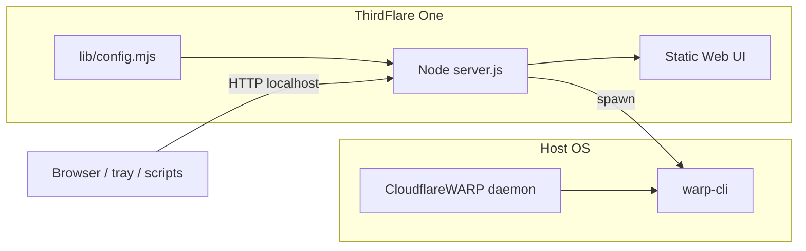

# Architecture

## Problem

Cloudflare ships a full **Cloudflare One** desktop client on Windows. Other platforms expose **`warp-cli`** and background daemons but no equivalent GUI. ThirdFlare One reimplements that control surface as a local HTTP API + optional Web UI, targeting **functional parity** and **drop-in compatibility** with existing WARP installs.

## High-level diagram



## Components

| Path | Role |
|------|------|
| `server.js` | HTTP server, `/api/*`, guarded `warp-cli` execution |
| `lib/config.mjs` | Layered configuration merge + session overrides |
| `public/` | Web UI (PWA-capable), optional when `webui.enabled=false` |
| `bin/thirdflare` | Launcher: port selection, daemon lifecycle, browser open |
| `bin/thirdflare-tray` | Optional `yad` notification-area menu |
| `lib/warp/status.mjs` | Shared `warp-cli` status parsing |
| `lib/notify/` | Desktop notifications (`notify-send`) + status watcher |
| `scripts/health-check.mjs` | Used by launcher and CI to verify `/api/health` |

## Desktop notifications

When `ui.notifications` is true (default), `server.js` starts `lib/notify/status-watcher.mjs` on listen — independent of the Web UI or SSE clients. The watcher runs `warp-cli --listen status`, shares `parseStatus` from `lib/warp/status.mjs`, and calls `notify-send` (libnotify) only on meaningful transitions (connect / disconnect / daemon lost / unhealthy), debounced ~1.5s. Requires `notify-send` on `PATH`; disable with `ui.notifications: false` or `THIRDFLARE_DISABLE_NOTIFICATIONS=1`.

## API surface

| Route | Method | Purpose |
|-------|--------|---------|
| `/api/health` | GET | Liveness; returns `app: "thirdflare"` |
| `/api/version` | GET | Installed semver, channel, update source |
| `/api/config` | GET | Effective config + source flags |
| `/api/config/session` | POST | Provisional in-app overrides |
| `/api/account` | GET | Structured registration / account DTO |
| `/api/snapshot` | GET | Aggregated `warp-cli` command output |
| `/api/events` | GET | SSE stream from `warp-cli --listen status` |
| `/api/action` | POST | Whitelisted mutations (`connect`, `setMode`, …) |
| `/api/killswitch` | GET/POST | nftables kill-switch desired/active (Linux) |
| `/api/killswitch/enrollment-pause` | POST | Pause/resume KS around Zero Trust enrollment |
| `/api/update/check` | GET | Channel/manifest/GitHub update check |
| `/api/update/forks` | GET | Allowed update sources |
| `/api/update/releases` | GET | Release list for owner/repo |
| `/api/update/source` | POST | Session override for update source |
| `/api/update/prepare` | POST | Download/verify prepare token |
| `/api/update/apply` | POST | Apply prepared AppImage update |

Contract file: [`openapi/thirdflare-api.json`](../openapi/thirdflare-api.json). Secrets in command output are redacted before JSON serialization.

## Configuration flow

1. **Boot** — `reloadConfig()` merges layers (see [CONFIGURATION.md](CONFIGURATION.md)).
2. **Listen** — `effectiveBind()` returns `127.0.0.1` unless `webui.enabled && webui.allowRemote`.
3. **Runtime** — Session overrides mutate an in-memory layer; GET `/api/config` reflects changes immediately for keys that do not require restart.
4. **WARP** — `warp.cli` selects binary; Flatpak sets `FLATPAK_ID` and uses `flatpak-spawn --host`.

## Platform matrix

| Platform | Daemon | Web UI | WARP CLI |
|----------|--------|--------|----------|
| Linux native | systemd user service or launcher | Optional | Host `warp-cli` |
| Linux Flatpak | same | Optional | `flatpak-spawn --host warp-cli` |
| Linux Snap (classic) | same | Optional | Host `warp-cli` |
| macOS Homebrew | manual / future launchd | Optional | Homebrew + Cloudflare WARP |
| Container (GHCR) | `node server.js` | Off by default | Mount host binary |

## Security model (v1)

- Binds to loopback unless explicitly configured for remote Web UI.
- No shell when invoking `warp-cli`; argument allow-lists for `/api/action`.
- Destructive operations require GUI confirmation.
- **Gap:** `/api/action` has no CSRF token yet — acceptable only on trusted localhost; do not expose remotely without adding auth.

## Packaging layout (FHS)

```
/usr/bin/thirdflare
/usr/bin/cloudflare-one-gui          # legacy wrapper
/usr/lib/thirdflare/server.js
/usr/lib/thirdflare/lib/config.mjs
/usr/lib/thirdflare/public/
/etc/default/thirdflare
/etc/thirdflare/config.json.example
/usr/lib/systemd/user/thirdflare.service
```

## Testing

- `npm run check` — syntax
- `npm run test:all` — Plane M (mock CLI, OpenAPI shapes, units)
- `npm run test:ui` — Playwright against mock daemon
- `npm run test:warp:real` — Plane R (optional Linux)
- CI package smoke — deb/rpm on Ubuntu

See [CI.md](CI.md) for confidence levels and [PACKAGING.md](PACKAGING.md) for release mechanics.

## Parity strategy

The in-app **Parity** page maps Windows Cloudflare One screens to implemented `warp-cli` workflows. New surfaces should:

1. Add read commands to `COMMANDS` in `server.js`.
2. Add guarded actions to `ACTIONS` / `actionArgs`.
3. Extend `public/app.js` views.
4. Document behavior in CHANGELOG.

Native shells (Tauri/Electron) can embed the same API without forking WARP logic.
